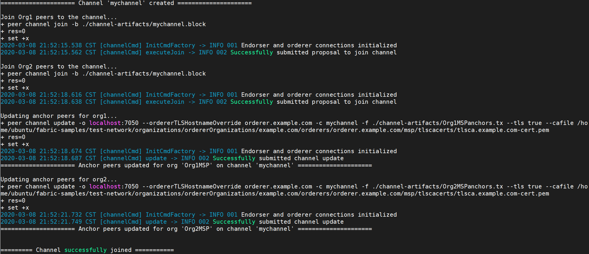

# ***`Hyperledger fabric`* installation on *`Ubuntu 18x`***

## **Prerequisites**

- ### **Install *`Git`***

  ```
  sudo add-apt-repository ppa:git-core/ppa
  sudo apt update
  sudo apt install git
  ```
  
  

- ### **Install *`cURL`***

  ```
  sudo apt install curl
  ```

- ### **Install *`wget`***

  ```
  sudo apt install wget
  ```

- ### **Install *`Docker`* and Docker *`Compose`***

  ```
  sudo apt install docker.io docker-compose
  docker --version
  docker-compose --version
  ```

  
  

  - *Make sure the docker daemon is running.*

    ```
    sudo systemctl start docker
    ```

  - *Optional: If you want the docker daemon to start when the system starts, use the following:*

    ```
    sudo systemctl enable docker
    ```

    

  - *Add your user to the docker group.*

    ```
    sudo usermod -a -G docker <username>
    ```

- ### **Install *`Go 1.13.x`* Programming Language**

  - Search the go version from apt repository.

    ```
    apt-cache madison golang
    ```

    

    - If searched go version is 1.13.x

      ```
      sudo apt install golang=1.13~4ubuntu1
      ```

    - Else using *`data/go1.13.8.linux-amd64.tar.gz`* to install golang.

      ```
      sudo tar -C /usr/local -xzf data/go1.13.8.linux-amd64.tar.gz
      export PATH=$PATH:/usr/local/go/bin
      export GOPATH=$HOME/go
      export PATH=$PATH:$GOPATH/bin
      go version
      ```
  
      
      

- ### **Install *`Node.js Runtime`* and *`NPM`***

  - For Node.js, **version 8** is supported from `8.9.4` and higher. **version 10** is supported from `10.15.3` and higher.

    ```
    sudo apt-cache madison nodejs
    ```

    

    - If searched nodejs version is 8.9.4 / 10.15.3 and higher.

      ```
      sudo apt install nodejs npm
      nodejs -v
      npm -v
      ```
  
      
      

    - Else you could see https://nodejs.org/dist.

  - To confirm the version of NPM installed. You can upgrade the npm tool with the following command:

    ```
    sudo npm install npm@5.6.0 -g
    sudo npm -v
    ```

    

## **Install Samples, Binaries and Docker Images**

- ### **Clone the https://github.com/hyperledger/fabric-samples repository**

  ```
  git clone --recursive https://github.com/hyperledger/fabric-samples.git
  cd fabric-samples
  git tag
  git checkout -b v2.0.0-beta
  git branch
  ```
  
  
  
  

- ### **Install the Hyperledger Fabric platform-specific `binaries` and `config files` for the version specified into the *`/bin`* and *`/config`* directories of fabric-samples**

  - Fetch *`bootstrap.sh`* from fabric repository using.

    ```
    curl -sS https://raw.githubusercontent.com/hyperledger/fabric/master/    scripts/bootstrap.sh -o ./scripts/bootstrap.sh
    ```
    
    

  - Change file mode to executable.

    ```
    sudo chmod +x ./scripts/bootstrap.sh
    ```

  - Download *`binaries`* and *`docker images`*.

    ```
    sudo ./scripts/bootstrap.sh 2.0.0-beta
    ```

    - If you meet issue as below.

      

    - You need to copy *`data/hyperledger-fabric-ca-linux-amd64-1.4.6.tar.gz`* and *`data/hyperledger-fabric-linux-amd64-2.0.0-beta.tar.gz`* to *`fabric-samples`* folder.

      ```
      cp /home/ubuntu/Documents/Hyperledger fabric installation on Ubuntu18x/   data/hyperledger-fabric* /home/ubuntu/fabric-samples
      ```

    - Then edit the *`scripts/bootstrap.sh`* file. *(Update `download()` function as below)*.

      ```sh
      # This will download the .tar.gz
      download() {
          local BINARY_FILE=$1
          local URL=$2
      
          if [ ! -f "${BINARY_FILE}" ]; then
              echo "===> Downloading: " "${URL}"
              curl -L --retry 5 --retry-delay 3 "${URL}"
          fi
      
          tar xzvf "${BINARY_FILE}" || rc=$?
      
          if [ -n "$rc" ]; then
              echo "==> There was an error downloading the binary file."
              return 22
          else
              echo "==> Done."
          fi
      }
      ```

    - Run the the *`scripts/bootstrap.sh`* again.

      ```
      sudo ./scripts/bootstrap.sh 2.0.0-beta
      ```
      
      

  - Add *`fabric-samples/bin`* into *`PATH`*.

    ```
    export PATH=/home/ubuntu/fabric-samples/bin/:$PATH
    ```

## **Using the Fabric test network**

- ### **Bring up the test network**

  - Creat docker containers

    ```
    cd fabric-samples/test-network
    ./network.sh -h
    ./network.sh down
    ./network.sh up
    ```

    
    
    

  - List docker containers

    ```
    docker ps -a
    ```

    

- ### **Creating a channel**

  ```
  ./network.sh createChannel
  ```

  

- ### **Starting a chaincode on the channel**

  ```
  ./network.sh deployCC
  ```
  
  

- ### **Interacting with the network**

  ```
  export PATH=${PWD}/../bin:${PWD}:$PATH
  export FABRIC_CFG_PATH=$PWD/../config/
  ```

  - Set the environment variables that allow you to operate the peer CLI as Org1.

    ```
    # Environment variables for Org1

    export CORE_PEER_TLS_ENABLED=true
    export CORE_PEER_LOCALMSPID="Org1MSP"
    export CORE_PEER_TLS_ROOTCERT_FILE=${PWD}/organizations/    peerOrganizations/org1.example.com/peers/peer0.org1.example.com/tls/ca. crt
    export CORE_PEER_MSPCONFIGPATH=${PWD}/organizations/peerOrganizations/  org1.example.com/users/Admin@org1.example.com/msp
    export CORE_PEER_ADDRESS=localhost:7051
    ```

  - Query the ledger from your CLI.

    ```
    peer chaincode query -C mychannel -n fabcar -c '{"Args":["queryAllCars"]    }'
    ```

    

  - Change the owner of a car on the ledger.

    ```
    peer chaincode invoke -o localhost:7050 --ordererTLSHostnameOverride orderer.example.com --tls true --cafile ${PWD}/organizations/ordererOrganizations/example.com/orderers/orderer.example.com/msp/tlscacerts/tlsca.example.com-cert.pem -C mychannel -n fabcar --peerAddresses localhost:7051 --tlsRootCertFiles ${PWD}/organizations/peerOrganizations/org1.example.com/peers/peer0.org1.example.com/tls/ca.crt --peerAddresses localhost:9051 --tlsRootCertFiles ${PWD}/organizations/peerOrganizations/org2.example.com/peers/peer0.org2.example.com/tls/ca.crt -c '{"function":"changeCarOwner","Args":["CAR9","Dave"]}'
    ```

    

  - Set the following environment variables to operate as Org2.

    ```
    # Environment variables for Org2

    export CORE_PEER_TLS_ENABLED=true
    export CORE_PEER_LOCALMSPID="Org2MSP"
    export CORE_PEER_TLS_ROOTCERT_FILE=${PWD}/organizations/    peerOrganizations/org2.example.com/peers/peer0.org2.example.com/tls/ca. crt
    export CORE_PEER_MSPCONFIGPATH=${PWD}/organizations/peerOrganizations/  org2.example.com/users/Admin@org2.example.com/msp
    export CORE_PEER_ADDRESS=localhost:9051
    ```

  - Query the fabcar chaincode running on peer0.org2.example.com.

    ```
    peer chaincode query -C mychannel -n fabcar -c '{"Args":    ["queryAllCars"]}'
    ```
    
    

- ### **Bring down the network**

  ```
  ./network.sh down
  ```

  

- ### **Bring up the network with Certificate Authorities**

  ```
  ./network.sh up -ca
  ```
  
  

- ### **Bring down the network with Certificate Authorities**

  ```
  sudo ./network.sh down -ca
  ```
  
  
